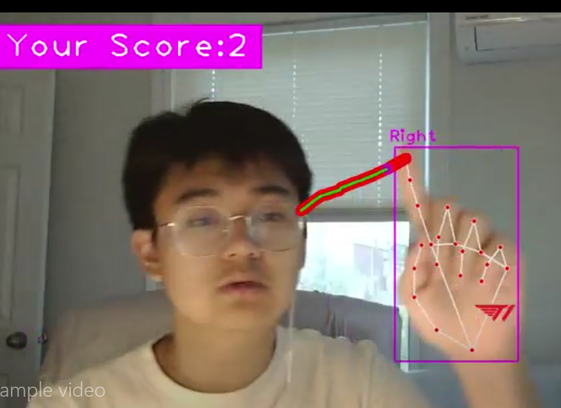

# Introduction

My name is Yiren, I am currently a 4th year undergraduate studying at McMaster University. My program is Math and Computer Science and my future research direction is data science/ data learning related area. 

I studied math during my first year and switched to computer science program during my second year. I find coding interesting and I have a strong faith that my output can help me survive through the competitions among computer science people. 

This repository shows my self-learning experience for different libraries and understandings of the coding. I will try my best to get better.

## Skills List

In the repository:

- Pygame
- Pytorch
- Sklearn and ml related
- LDA
- Matplotlib, seaborn, numpy
- python spider
- front end pages
- Tensorboard
- OCR
- Neo4j
- OpenCV
- Yolo
- Node.js
- Springboot
- Ubuntu
- nginx

Not in this repository but I did have experience:

- Excel and MS office related
- Latex
- SQL
- C++
- Java

## Image preview of some projects

Spider results in csv

LDA analysis among architecture models

Modeling thought process on vgg16 with output of tensorboard.

fake 3d visualization of zhumulangma mountain

A simulation of predator-prey model

Neo4j project about knowledge graph for architectures.

A small snake game made using opencv and mediapipe
An online website which uses the model from https://github.com/MiracleTanC/Neo4j-KGBuilder to help make an interactive neo4j knowledge graph of architecture words 121.196.96.223
